# C4 Component Diagram: Java Collection Visualizer

## Swing Application - Компоненты

```mermaid
C4Component
    title Component Diagram - Java Collection Visualizer

    Container_Boundary(entry, "Entry Point") {
        Component(main, "Main", "Java Class", "EDT initialization, создание GameWindow")
    }

    Container_Boundary(ui_core, "UI Core") {
        Component(game_window, "GameWindow", "JFrame", "Главное окно с CardLayout навигацией")
        Component(tab_layout, "TabLayout", "CardLayout", "Переключение между 11 визуализаторами")
    }

    Container_Boundary(list_viz, "List Visualizers") {
        Component(array_panel, "ArrayPanel", "JPanel", "Визуализация ArrayList")
        Component(array_control, "ControlPanel", "JPanel", "add, remove, get, set, resize")
        Component(linked_panel, "LinkedListPanel", "JPanel", "Визуализация LinkedList с узлами")
        Component(linked_control, "LinkedListControlPanel", "JPanel", "addFirst/Last, removeFirst/Last")
        Component(raw_array_panel, "ArrayDisplayPanel", "JPanel", "Визуализация primitive array")
        Component(raw_array_control, "ArrayControlPanel", "JPanel", "set by index, resize")
    }

    Container_Boundary(set_viz, "Set Visualizers") {
        Component(hashset_panel, "HashSetPanel", "JPanel", "Визуализация HashSet с бакетами")
        Component(hashset_control, "HashSetControlPanel", "JPanel", "add, remove, contains")
        Component(linkedhashset_panel, "LinkedHashSetPanel", "JPanel", "HashSet + insertion order")
        Component(treeset_panel, "TreeSetPanel", "JPanel", "Визуализация TreeSet (BST)")
        Component(treeset_control, "TreeSetControlPanel", "JPanel", "add, remove, first, last")
    }

    Container_Boundary(map_viz, "Map Visualizers") {
        Component(hashmap_panel, "HashMapPanel", "JPanel", "Визуализация HashMap с бакетами")
        Component(hashmap_control, "HashMapControlPanel", "JPanel", "put, get, remove, containsKey")
        Component(linkedhashmap_panel, "LinkedHashMapPanel", "JPanel", "HashMap + insertion order")
        Component(treemap_panel, "TreeMapPanel", "JPanel", "Визуализация TreeMap (RB-Tree)")
        Component(treemap_control, "TreeMapControlPanel", "JPanel", "put, get, firstKey, lastKey")
    }

    Container_Boundary(deque_viz, "Deque Visualizer") {
        Component(deque_panel, "ArrayDequePanel", "JPanel", "Визуализация circular buffer")
        Component(deque_control, "ArrayDequeControlPanel", "JPanel", "addFirst/Last, pollFirst/Last")
    }

    Container_Boundary(legacy_viz, "Legacy Visualizer") {
        Component(hashtable_panel, "HashtablePanel", "JPanel", "Визуализация Hashtable")
        Component(hashtable_control, "HashtableControlPanel", "JPanel", "put, get, remove")
    }

    Container_Boundary(models, "Visual Models") {
        Component(visual_arraylist, "VisualArrayList", "Java Class", "ArrayList с tracking capacity")
        Component(visual_linkedlist, "VisualLinkedList", "Java Class", "LinkedList с VisualNode")
        Component(visual_array, "VisualArray", "Java Class", "Primitive array wrapper")
        Component(visual_deque, "VisualArrayDeque", "Java Class", "ArrayDeque simulation")
        Component(visual_hashset, "VisualHashSet", "Java Class", "HashSet с bucket visualization")
        Component(visual_treeset, "VisualTreeSet", "Java Class", "TreeSet с BST visualization")
        Component(visual_hashmap, "VisualHashMap", "Java Class", "HashMap с bucket chains")
        Component(visual_treemap, "VisualTreeMap", "Java Class", "TreeMap с RB-Tree")
        Component(visual_hashtable, "VisualHashtable", "Java Class", "Legacy Hashtable")
    }

    Container_Boundary(model_helpers, "Model Helpers") {
        Component(visual_element, "VisualElement", "Java Class", "Элемент с анимацией: x, y, alpha, scale")
        Component(visual_node, "VisualNode", "Java Class", "Узел LinkedList: data, next, prev refs")
        Component(visual_entry, "VisualEntry", "Java Class", "Key-Value пара для Map")
        Component(visual_bucket, "VisualBucket", "Java Class", "Хэш-бакет с chain")
    }

    Container_Boundary(animation, "Animation Engine") {
        Component(swing_timer, "Swing Timer", "javax.swing.Timer", "60fps callback (16ms interval)")
        Component(delta_time, "Delta Time Calculator", "Java", "Плавность анимации")
        Component(tweening, "Tweening", "Java", "position, alpha, scale interpolation")
    }

    Container_Boundary(dialogs, "Memory Dialogs") {
        Component(memory_dialog, "MemoryInfoDialog", "JDialog", "Базовая информация о памяти")
        Component(array_memory, "ArrayMemoryDialog", "JDialog", "Array memory layout")
        Component(linked_memory, "LinkedListMemoryDialog", "JDialog", "Node overhead analysis")
        Component(hashmap_memory, "HashMapMemoryDialog", "JDialog", "Bucket efficiency")
    }

    Rel(main, game_window, "creates")
    Rel(game_window, tab_layout, "manages")

    Rel(tab_layout, array_panel, "shows")
    Rel(tab_layout, linked_panel, "shows")
    Rel(tab_layout, hashset_panel, "shows")
    Rel(tab_layout, hashmap_panel, "shows")
    Rel(tab_layout, treeset_panel, "shows")
    Rel(tab_layout, deque_panel, "shows")

    Rel(array_panel, visual_arraylist, "visualizes")
    Rel(linked_panel, visual_linkedlist, "visualizes")
    Rel(hashset_panel, visual_hashset, "visualizes")
    Rel(hashmap_panel, visual_hashmap, "visualizes")
    Rel(treeset_panel, visual_treeset, "visualizes")
    Rel(deque_panel, visual_deque, "visualizes")

    Rel(visual_arraylist, visual_element, "contains")
    Rel(visual_linkedlist, visual_node, "contains")
    Rel(visual_hashmap, visual_bucket, "contains")
    Rel(visual_bucket, visual_entry, "contains")

    Rel(swing_timer, array_panel, "triggers repaint")
    Rel(swing_timer, delta_time, "calculates")
    Rel(visual_element, tweening, "uses")

    Rel(array_panel, array_memory, "opens")
    Rel(hashmap_panel, hashmap_memory, "opens")
```



## Описание компонентов

### UI Core

| Компонент | Тип | Ответственность |
|-----------|-----|-----------------|
| Main | Entry | SwingUtilities.invokeLater() |
| GameWindow | JFrame | Главное окно приложения |
| TabLayout | CardLayout | Навигация между визуализаторами |

### List Visualizers

| Panel | Control | Model |
|-------|---------|-------|
| ArrayPanel | ControlPanel | VisualArrayList |
| LinkedListPanel | LinkedListControlPanel | VisualLinkedList |
| ArrayDisplayPanel | ArrayControlPanel | VisualArray |

### Set Visualizers

| Panel | Control | Model |
|-------|---------|-------|
| HashSetPanel | HashSetControlPanel | VisualHashSet |
| LinkedHashSetPanel | LinkedHashSetControlPanel | VisualLinkedHashSet |
| TreeSetPanel | TreeSetControlPanel | VisualTreeSet |

### Map Visualizers

| Panel | Control | Model |
|-------|---------|-------|
| HashMapPanel | HashMapControlPanel | VisualHashMap |
| LinkedHashMapPanel | LinkedHashMapControlPanel | VisualLinkedHashMap |
| TreeMapPanel | TreeMapControlPanel | VisualTreeMap |

### Model Helpers

| Класс | Поля | Назначение |
|-------|------|------------|
| VisualElement | x, y, targetX, targetY, alpha, scale | Анимированный элемент |
| VisualNode | data, next, prev, x, y | Узел связного списка |
| VisualEntry | key, value, hash | Key-Value для Map |
| VisualBucket | entries[], index | Хэш-бакет |

## Animation Pipeline

```
Swing Timer (16ms)
    │
    ▼
Calculate Delta Time
    │
    ▼
For each VisualElement:
    ├─► Update position (lerp to target)
    ├─► Update alpha (fade in/out)
    └─► Update scale (grow/shrink)
    │
    ▼
panel.repaint()
    │
    ▼
paintComponent(Graphics2D g)
    │
    ▼
Render elements with current state
```

## Type-Based Coloring

| Java Type | Color | RGB |
|-----------|-------|-----|
| int | Cyan | #00FFFF |
| double | Pink | #FF69B4 |
| String | Green | #00FF00 |
| boolean | Yellow | #FFFF00 |
| char | Purple | #9370DB |
| Object | Orange | #FFA500 |

## Memory Calculation Example (ArrayList)

```
ArrayList<Integer> (size=5, capacity=10):
────────────────────────────────────────
Object Header:        12 bytes
elementData ref:       4 bytes
size field:            4 bytes
modCount field:        4 bytes
────────────────────────────────────────
ArrayList overhead:   24 bytes

Object[] (length=10):
────────────────────────────────────────
Array Header:         16 bytes
10 × Integer refs:    40 bytes
────────────────────────────────────────
Array overhead:       56 bytes

5 × Integer objects:
────────────────────────────────────────
5 × (12 header + 4 value): 80 bytes
────────────────────────────────────────

TOTAL: 24 + 56 + 80 = 160 bytes
```

## MVC Pattern

```
┌─────────────────────────────────────────────┐
│                    VIEW                      │
│  ArrayPanel, LinkedListPanel, HashMapPanel  │
│         paintComponent(Graphics2D)          │
└─────────────────────┬───────────────────────┘
                      │
                      │ observes
                      ▼
┌─────────────────────────────────────────────┐
│                   MODEL                      │
│ VisualArrayList, VisualLinkedList, etc.     │
│    add(), remove(), get(), set()            │
└─────────────────────┬───────────────────────┘
                      ▲
                      │ modifies
                      │
┌─────────────────────┴───────────────────────┐
│                 CONTROLLER                   │
│  ControlPanel, LinkedListControlPanel, etc. │
│         JButton onClick handlers            │
└─────────────────────────────────────────────┘
```
