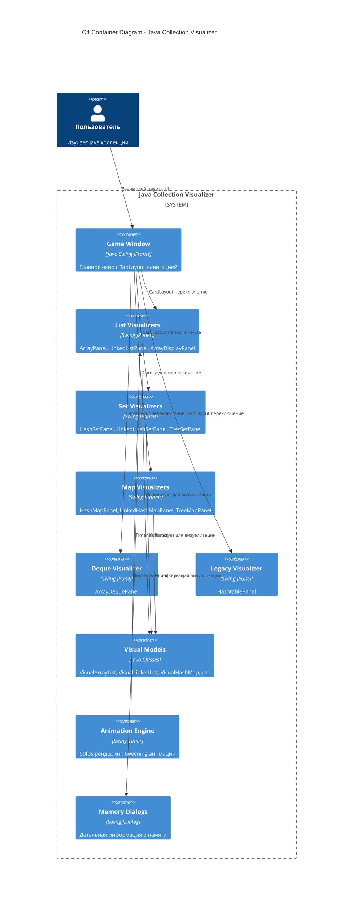

# C4 Container Diagram: Java Collection Visualizer

## Обзор системы
Desktop GUI приложение для визуализации работы Java коллекций в sci-fi стиле.

## Диаграмма контейнеров



## Основные контейнеры

| Контейнер | Технология | Ответственность |
|-----------|------------|-----------------|
| Game Window | Swing JFrame | Главное окно, навигация |
| List Visualizers | Swing JPanels | ArrayList, LinkedList, Array |
| Set Visualizers | Swing JPanels | HashSet, LinkedHashSet, TreeSet |
| Map Visualizers | Swing JPanels | HashMap, LinkedHashMap, TreeMap |
| Deque Visualizer | Swing JPanel | ArrayDeque |
| Legacy Visualizer | Swing JPanel | Hashtable (Dictionary) |
| Visual Models | Java Classes | Симуляция структур данных |
| Animation Engine | Swing Timer | 60fps анимация элементов |
| Memory Dialogs | Swing JDialog | Информация о памяти |

## Визуализируемые структуры

| Тип | Структуры |
|-----|-----------|
| List | ArrayList, LinkedList, Array |
| Set | HashSet, LinkedHashSet, TreeSet |
| Map | HashMap, LinkedHashMap, TreeMap |
| Queue | ArrayDeque |
| Legacy | Hashtable |

## Особенности архитектуры

- **Standalone приложение** - никаких внешних зависимостей
- **MVC паттерн** - Model (Visual*), View (*Panel), Controller (*ControlPanel)
- **Анимация** - Timer-based с delta time для плавности
- **Type coloring** - int→Cyan, String→Green, double→Pink

## Запуск

```bash
javac -d out -sourcepath src/main/java src/main/java/game/**/*.java
java -cp out game.Main
```
